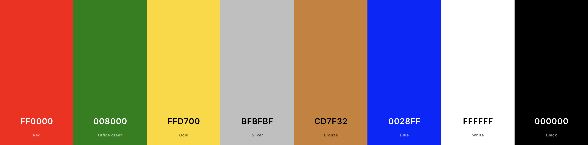

# festive-quiz-game

### Colors Scheme

[coolors.co](https://coolors.co/0d6efd-000000-212529-6c757d-ffffff)



```css
:root {
  /* Colours */
  --clr-primary-1: #ff0000;
  --clr-primary-2: #008000;
  /* Secondary colour */
  --clr-secondary-1: #ffd700;
  --clr-secondary-2: #bfbfbf;
  --clr-secondary-3: #cd7f32;
  --clr-secondary-4: #0028ff;
  /* white/black colours */
  --clr-white: #ffffff;
  --clr-black: #111111;
}
```

# Christmas Quiz Game

![Game Screenshot/Logo]

## Description

Welcome to the Christmas Quiz Game! This game is designed to test your knowledge about Christmas traditions, history, songs, movies, and more. Challenge yourself or play with friends and family to see who knows the most about the festive season!

## Features

- Multiple-choice questions about various Christmas-related topics.
- Interactive and user-friendly interface.
- Scores and leaderboard to track performance.
- Levels or difficulty settings for different player experiences.

## Home
The home page includes a hero image at the top with a link to the quiz section, creating an inviting and thematic entry point for users. 

A dynamic "Festive Trivia" section displays interesting facts, powered by a trivia API, which makes the page more dynamic. 

The site also showcases character representations of the developers, which, when clicked, open modals containing fun facts and information about each developer, adding a personal touch to the website. 

Additionally, there's a scroll-up button that appears when the user scrolls down, providing a convenient way to return to the top of the page. This button enhances the user experience by offering easy navigation.

## Quiz

The Trivia Quiz Game's logic is structured across multiple JavaScript modules. In utils.js, it initializes game settings like difficulty, question type, and scoring parameters, leveraging localStorage to retain user preferences.

The quiz dynamically fetches questions and updates the game state, including handling timers and scoring. quiz.js manages UI interactions, displaying questions and handling user responses, including time-based scoring and progress through the quiz.

quizState.js tracks the user's progress and score, contributing to a responsive and interactive quiz experience. This modular approach ensures clean separation of concerns and enhances maintainability.

## Settings
The settings page allows users to customize their quiz experience by selecting their preferred difficulty level and question type. Changes to these settings impact the quiz's dynamics, such as the time available to answer questions, starting points, and penalties for timeouts. 

The page employs local storage to save and persist user preferences, ensuring that these settings are maintained across browser sessions.

## Leaderboard

The leaderboard page displays the top 10 high scores, fetched from an external API. These scores are presented in a table format, providing a clear and organized view of the top performers in the quiz. This feature adds a competitive element to the quiz, encouraging users to strive for higher scores.

## How to Play

- where x depends on difficulty
- You start with <span id="points">(x)</span> points.
- When a new question loads, you have
  <span id="time">(x)</span> seconds to answer.
- Use the bet slider to place a bet.
- If your answer is incorrect, you will lose the points you bet.
- If you answer faster, you might get bonus points.
- If you you loose all your points, the game will end.

## Difficulty settings and impact on quiz

The quiz difficulty impacts the quiz's dynamics, such as the time available to answer questions, starting points, and penalties for timeouts.

|           | Easy     | Medium    | hard    |
|----------|----------|----------|-----------|
| Timer | 15 seconds | 12 seconds |  8 seconds   |
| Timeout penalty | 5 X question # |10 X question # |   15 X question #  |
|Bonus Multiplier| >10s: 1.5x | >9s: 1.8x, >5s: 1.5x  |  >6s: 2x, >4s: 1.5x   |

## Areas for improvement
- Utilizing a Build Tool: Implementing a build tool like Vite could enhance the development experience by offering features like hot module replacement and efficient bundling.

- Automated Testing: Adding automated testing would ensure the reliability and robustness of the application, catching bugs early in the development cycle.

- Custom Leaderboard Logic: Instead of relying on external APIs, implementing our own logic for storing and managing leaderboards would give more control over data handling and presentation.

- Improved Input Validation: Enhancing input validation in the leaderboard confirmation modal would improve data integrity and user experience, preventing erroneous entries.

- Data Loading Presentation: Optimizing the presentation of data while it's being loaded or fetched can enhance user experience, such as using loaders or placeholders.

- Moving Beyond Bootstrap: While Bootstrap is helpful for quick styling, it can be limiting for customized designs. Transitioning to a more flexible styling approach would allow for more unique and tailored UI designs.

- Adopting a Frontend Framework: Given the interactive nature of the site, a frontend framework (like React, Vue, or Angular) could be employed to improve the site's reactivity and organization.

- External Services for Image Hosting: Utilizing external services for image hosting can optimize loading times and reduce server load, leading to better performance and scalability.

- Expanding Trivia Functionality: Although the quiz is themed around the '12 Days of Christmas', the trivia API supports fetching more questions. Implementing a feature to utilize this capability can add variety and depth to the quiz experience.


## Requirements
- Web browser (Chrome, Firefox, Safari, etc.)

## Technologies Used

- HTML/CSS/JavaScript
- [bootstrap](https://getbootstrap.com/docs/5.0/getting-started/introduction/)
- [animate.css](https://animate.style/)
- [trivia api](https://trivia-api-fe683df325a4.herokuapp.com/trivia)

## Credits

- Game developed by:

- Oliver Craigie

  - [GitHub](https://github.com/ogc1231)
  - [LinkedIn](https://www.linkedin.com/in/olivercraigie/)

- Daniel Callaghan

  - [GitHub](https://github.com/xiaoniuniu89)
  - [LinkedIn](https://www.linkedin.com/in/danielcallaghan89/)

- Johnny Trinh

  - [GitHub](https://github.com/johnnysontrinh)
  - [LinkedIn](https://www.linkedin.com/in/johnny-trinh-732755123/)

- Renwar Pappiland

  - [GitHub](https://github.com/Renwar-P)
  - [LinkedIn](https://www.linkedin.com/in/renwar-pappiland-7aa1a414a/)

- Attribution for any external resources used (images, libraries, etc.)

## License

This project is licensed under the [License Name]. See the [LICENSE](LICENSE) file for details.

## Screenshots/Demo

![Screenshot 1]
![Screenshot 2]
