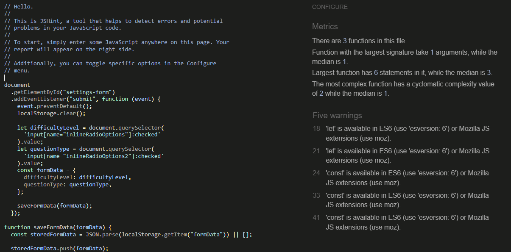
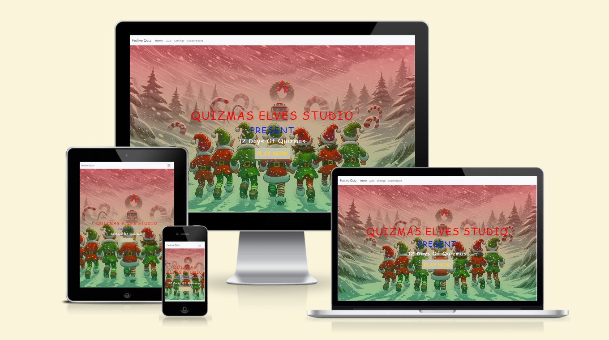
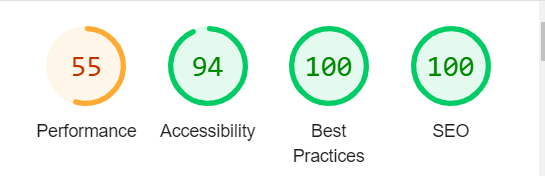

# Testing
Return back to the [README.md](README.md) file.

## Code Validation
Code was tested for errors using a range of validation tool shown below.

### HTML
[HTML W3C Validator](https://validator.w3.org) was used to validate the HTML file.

| Page | Screenshot | Notes |
| --- | --- | --- | --- |
| Home |  | No warnings or errors | 

### CSS
The recommended [CSS Jigsaw Validator](https://jigsaw.w3.org/css-validator) was used to validate the CSS file.

| File | Screenshot | Notes |
| --- | --- | --- | --- |
| style.css |  | No warnings or errors | 

### JavaScript
The recommended [JShint Validator](https://jshint.com) was used to validate the JS file.

| File | Screenshot | Notes |
| --- | --- | --- |
| script.js |  | No errors or warnings | 

## Browser Compatibility
Webpage tested on multiple browsers to check for compatibility issues. All worked as expected.

| Browser | Screenshot | Notes |
| --- | --- | --- |
| Chrome |  | Works as expected |
| Firefox |  | Works as expected |
| Edge |  | Works as expected |

## Responsiveness
Webpage tested on multiple devices to check for compatibility issues. All worked as expected.

| Device | Screenshot | Notes |
| --- | --- | --- |
| Phone (DevTools) |  | Works as expected |
| Tablet (DevTools) |  | Works as expected |
| Laptop |  | Works as expected |
| Desktop |  | Works as expected | 

## Lighthouse Audit
Project tested using the Lighthouse Audit tool to check for any major issues.

| Page | Size | Screenshot | Notes |
| --- | --- | --- | --- |
| Home | Mobile |  | No major issues | 
| Home | Desktop |  | No major issues |

## User Story Testing
User Story goals the project fulfils.

| User Story | Screenshot |
| --- | --- |
| example - As a user, I can to activate audio files based on my input. |  |
| example - As a user, I can to activate audio files based on my input. |  |

## Defensive Programming - Input Testing & Validation 
Defensive programming - Input Testing & Validation was manually tested with the below user acceptance testing:

| Page | User Action | Expected Result | Pass/Fail | Comments |
| --- | --- | --- | --- | --- |
| Homepage | | | | |
| | Click play game button | Redirects user to quiz page | Pass | As expected |
| Quiz Page | | | | |
| | Click start button | User is shown first question | Pass | As expected |
| Settings Page | | | | |
| | User checked hard difficulty option | User is only shown hard questions in quiz | Pass | As expected |

## Bugs
Below are the currently known bugs, there may be other that have not yet been discovered. 

| Bug | Description | Screenshot |
| --- | --- | --- |
| Bug 1 | Description |  |
| Bug 2 | Description |  |
