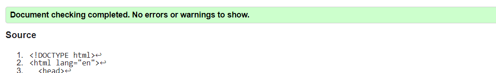
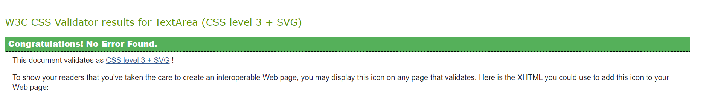

# Testing
Return back to the [README.md](README.md) file.

## Code Validation
Code was tested for errors using a range of validation tool shown below.

### HTML
[HTML W3C Validator](https://validator.w3.org) was used to validate the HTML file.

| Page | Screenshot | Notes |
| --- | --- | --- | --- |
| Home |  | No warnings or errors |

### CSS
The recommended [CSS Jigsaw Validator](https://jigsaw.w3.org/css-validator) was used to validate the CSS file.

| File | Screenshot | Notes |
| --- | --- | --- | --- |
| style.css |  | No warnings or errors |

### JavaScript
The recommended [JShint Validator](https://jshint.com) was used to validate the JS file.
